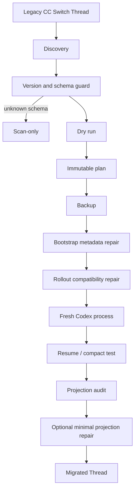

# CC Switch Codex Migrator

[](https://github.com/lilbridge520-pixel/ccswitch-codex-migrator/actions/workflows/tests.yml)
[](https://github.com/lilbridge520-pixel/ccswitch-codex-migrator/releases)
[](LICENSE)
[](https://www.python.org/)
[](https://github.com/lilbridge520-pixel/ccswitch-codex-migrator/releases/tag/v0.1.0-beta)

Safely repair legacy Codex threads created through CC Switch or custom providers so they can resume under the official OpenAI Codex runtime.

> **v0.1.0-beta / Experimental.** This is an unofficial community tool, not an OpenAI or CC Switch product.

## Contents

- [Before → After](#before--after)
- [How it works](#how-it-works)
- [Quick Start](#quick-start)
- [Safety by Design](#safety-by-design)
- [Compatibility and testing](#compatibility-and-testing)
- [Installation and usage](#installation-and-usage)
- [Migration stages](#migration-stages)
- [Project status and limitations](#project-status-and-limitations)
- [Contributing and security](#contributing-and-security)

## Before → After

The following is a synthetic illustration, not a real user thread:

```text
Before
  failed to load configuration:
  Model provider 'OpenAI' not found
  legacy resp_chatcmpl / reasoning IDs
  remote compact → 400 / 404

After
  provider: openai
  model: gpt-6.1-sol
  thread/resume       ✓
  reconstruction      ✓
  remote compact      ✓
  projection audit    ✓
  new assistant turn  ✓
```

## How it works



## Quick Start

The supported Windows entrypoint is PowerShell. Start with a read-only scan:

```powershell
git clone https://github.com/lilbridge520-pixel/ccswitch-codex-migrator.git
cd ccswitch-codex-migrator

./scripts/Invoke-CcSwitchMigrator.ps1 scan `
  --codex-home <CODEX_HOME> `
  --thread-id <THREAD_ID> `
  --sqlite <CODEX_HOME>/thread_history_1.sqlite `
  --state-db <CODEX_HOME>/state_5.sqlite `
  --catalog-db <CODEX_HOME>/sqlite/codex-dev.db `
  --output <OUTPUT_DIR>/scan-report.json
```

Review the scan and generate a dry-run plan:

```powershell
./scripts/Invoke-CcSwitchMigrator.ps1 plan `
  --scan <OUTPUT_DIR>/scan-report.json `
  --operations <OUTPUT_DIR>/operations.json `
  --output <OUTPUT_DIR>/migration-plan.json
```

There is no implicit write command. Applying a plan requires explicit approval of its exact SHA-256, and unknown schemas remain scan-only.

## Safety by Design

| Mechanism | Behavior |
| --- | --- |
| Dry-run first | Discovery and planning do not write Codex data. |
| One thread at a time | No batch migration. |
| Immutable plans | Operations bind source hashes, lengths, ordinals, schema fingerprints, and database state. |
| Exact schema guards | Unknown layouts become scan-only. |
| Backups | Rollout and SQLite backups are created before approved writes. |
| Guarded SQLite writes | Unexpected row counts or state drift abort the transaction. |
| Rollback | Change journals and compensation updates support recovery. |
| Fresh-process gate | Runtime validation uses a new Codex Desktop process. |
| Auth protection | `auth.json` is never read or modified. Version 1 never writes `config.toml`. |

## Compatibility and testing

| Scenario | Status |
| --- | --- |
| Legacy provider/model metadata | ✅ End-to-end tested |
| Legacy message transport IDs | ✅ End-to-end tested |
| Legacy reasoning transport IDs | ✅ End-to-end tested |
| Function-call transport IDs | 🧪 Synthetic and partial validation |
| Bootstrap SQLite metadata | ✅ End-to-end tested |
| Remote compact validation | ✅ End-to-end tested |
| Projection offset repair | ✅ End-to-end tested |
| Custom-tool legacy records | ⚠️ Discovered and classified; limited real-world validation |
| Unknown future Codex schemas | 🔒 Scan-only by design |

The repository CI uses only synthetic fixtures. Private end-to-end validations are summarized without publishing project names, Thread IDs, paths, or messages.

## Installation and usage

Copy this directory to `<CODEX_HOME>/skills/ccswitch-codex-migrator` or install it through your local Codex skill manager. The wrapper exposes `scan`, `plan`, `plan-bootstrap`, `apply-bootstrap`, `apply-rollout`, `record-verification`, `repair-projection`, and their guarded rollback commands.

Scanning by cwd is supported by the Python entrypoint. Parent-directory matches are candidate-only until title, Thread ID, and session metadata confirm identity.

Read the relevant files in `references/` before applying a stage plan. Never use global string replacement; rollout records are parsed and patched by exact JSON path.

## Migration stages

1. Discovery and identity confirmation
2. Producer version and schema guards
3. Thread bootstrap metadata (`state_5.sqlite` and `codex-dev.db`)
4. Rollout settings migration
5. Compact-window legacy transport-ID cleanup
6. Static validation and fresh-process gate
7. `thread/resume`, reconstruction, and remote compact validation
8. Projection audit and minimal offset repair when independently planned

## Project status and limitations

**v0.1.0-beta — Experimental.** The project has a synthetic test suite, CI, and real end-to-end validation of the primary migration path. Codex internal schemas evolve; exact new fingerprints may require a future update. Batch migration is not supported, `auth.json` is never accessed, and version 1 never writes `config.toml`. Custom-tool records and additional function-call-heavy histories need more validation. Testing has primarily been performed on Windows.

## Contributing and security

See [CONTRIBUTING.md](CONTRIBUTING.md) and [SECURITY.md](SECURITY.md). Do not upload real rollout files, SQLite databases, credentials, scan reports containing chat history, or migration backups to issues or pull requests. Always make an independent backup before migration.

This is an unofficial community tool and is not affiliated with or endorsed by OpenAI or CC Switch.
